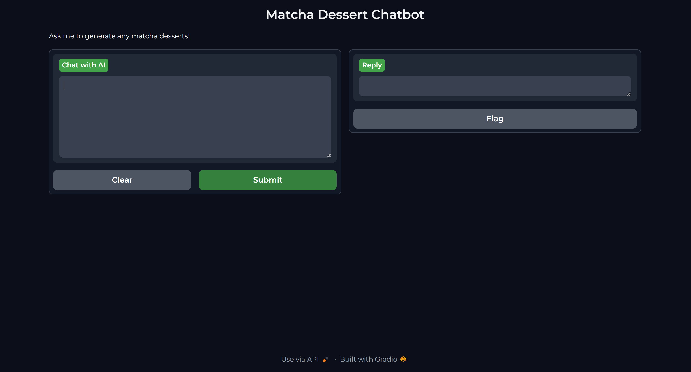

# Matcha Dessert Chatbot

## Project Description

The Matcha Dessert Chatbot is an AI-powered assistant designed to help bakers create matcha-flavored desserts. The chatbot provides detailed baking instructions and suggests alternative substitutes for ingredients. It is built using OpenAI's GPT-3.5-turbo model and Gradio for the user interface.

## Features

- Detailed baking instructions for matcha desserts
- Alternative ingredient suggestions
- User-friendly interface with Gradio
- Themed interface with a matcha green theme

